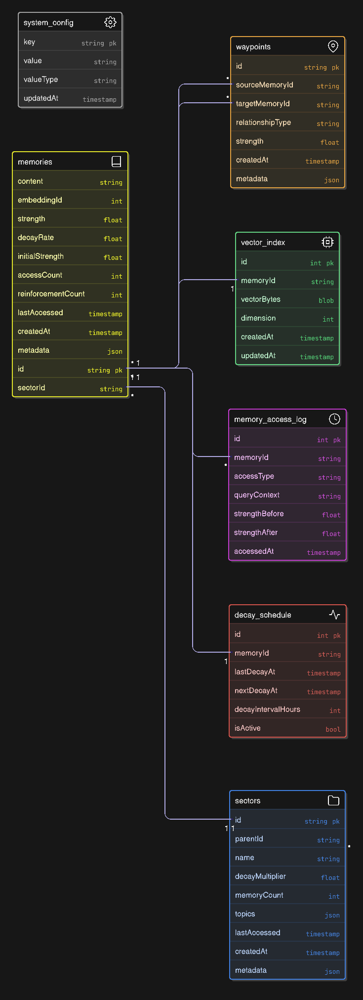

# Brain-Inspired Memory System - Database Schema Design

## Overview

This schema implements a brain-inspired memory system with three core components:
1. **HMD v2 Decay Algorithm** - Memory strength that weakens/strengthens over time
2. **Memory Sectors** - Hierarchical contextual organization
3. **Waypoints & Graph** - Multi-hop knowledge traversal

### Diagram



## Core Tables

### 1. Memories Table
```sql
CREATE TABLE memories (
    id TEXT PRIMARY KEY,                    -- UUID for unique identification
    content TEXT NOT NULL,                  -- The actual memory content
    embedding_id INTEGER,                   -- Reference to vector index
    strength REAL NOT NULL DEFAULT 0.8,     -- Current memory strength (0.0-1.0)
    decay_rate REAL NOT NULL DEFAULT 0.95, -- Individual decay rate
    initial_strength REAL NOT NULL,        -- Starting strength when created
    access_count INTEGER DEFAULT 0,        -- Number of times accessed
    reinforcement_count INTEGER DEFAULT 0, -- Manual reinforcements
    last_accessed DATETIME DEFAULT CURRENT_TIMESTAMP,
    created_at DATETIME DEFAULT CURRENT_TIMESTAMP,
    sector_id TEXT,                         -- Reference to memory sector
    metadata JSON,                          -- Flexible storage for extra data
    
    -- Indexes for performance
    INDEX idx_memories_strength (strength DESC),
    INDEX idx_memories_sector (sector_id),
    INDEX idx_memories_last_accessed (last_accessed DESC),
    INDEX idx_memories_created (created_at DESC)
);
```

**Key Fields Explained:**
- `strength`: Dynamic value that changes based on HMD v2 algorithm
- `decay_rate`: Controls how fast memory weakens (0.90-0.99 range)
- `access_count`: Used for access multiplier in decay calculation
- `reinforcement_count`: Tracks manual strengthening events

### 2. Memory Sectors Table
```sql
CREATE TABLE sectors (
    id TEXT PRIMARY KEY,
    name TEXT NOT NULL,
    parent_id TEXT,                        -- For hierarchical structure
    decay_multiplier REAL DEFAULT 1.0,     -- Affects all memories in sector
    memory_count INTEGER DEFAULT 0,        -- Cached count of memories
    topics JSON,                           -- Array of topic strings
    last_accessed DATETIME,
    created_at DATETIME DEFAULT CURRENT_TIMESTAMP,
    metadata JSON,
    
    FOREIGN KEY (parent_id) REFERENCES sectors(id),
    
    -- Indexes for hierarchical queries
    INDEX idx_sectors_parent (parent_id),
    INDEX idx_sectors_name (name),
    INDEX idx_sectors_last_accessed (last_accessed DESC)
);
```

**Sector Hierarchy Example:**
```
Root
├── Work
│   ├── Project_A
│   │   ├── Technical_Docs
│   │   └── Meeting_Notes
│   └── Project_B
├── Personal
│   ├── Health
│   └── Finance
└── Learning
    ├── AI_ML
    └── Programming
```

### 3. Waypoints Table (Graph Edges)
```sql
CREATE TABLE waypoints (
    id TEXT PRIMARY KEY,
    source_memory_id TEXT NOT NULL,
    target_memory_id TEXT NOT NULL,
    relationship_type TEXT NOT NULL,       -- semantic, temporal, causal, etc.
    strength REAL NOT NULL DEFAULT 0.8,    -- Edge strength for pathfinding
    created_at DATETIME DEFAULT CURRENT_TIMESTAMP,
    metadata JSON,
    
    FOREIGN KEY (source_memory_id) REFERENCES memories(id),
    FOREIGN KEY (target_memory_id) REFERENCES memories(id),
    
    -- Indexes for graph traversal
    INDEX idx_waypoints_source (source_memory_id),
    INDEX idx_waypoints_target (target_memory_id),
    INDEX idx_waypoints_strength (strength DESC),
    INDEX idx_waypoints_type (relationship_type),
    
    -- Composite index for efficient path queries
    INDEX idx_waypoints_composite (source_memory_id, target_memory_id, strength DESC)
);
```

**Relationship Types:**
- `semantic`: Similar meaning/content
- `temporal`: Time-based sequence
- `causal`: Cause-effect relationship
- `reference`: Direct citation/link
- `elaboration`: Expands on concept
- `contradiction`: Conflicting information

### 4. Vector Index Table
```sql
CREATE TABLE vector_index (
    id INTEGER PRIMARY KEY AUTOINCREMENT,
    memory_id TEXT NOT NULL UNIQUE,
    vector_bytes BLOB,                     -- Compressed vector data
    dimension INTEGER NOT NULL DEFAULT 1536, -- OpenAI ada-002 dimension
    created_at DATETIME DEFAULT CURRENT_TIMESTAMP,
    updated_at DATETIME DEFAULT CURRENT_TIMESTAMP,
    
    FOREIGN KEY (memory_id) REFERENCES memories(id),
    
    INDEX idx_vector_memory (memory_id)
);
```

**Note:** Actual vector operations handled by hnswlib-node, this stores metadata.

## Supporting Tables

### 5. Memory Access Log
```sql
CREATE TABLE memory_access_log (
    id INTEGER PRIMARY KEY AUTOINCREMENT,
    memory_id TEXT NOT NULL,
    access_type TEXT NOT NULL,             -- query, reinforce, manual
    query_context TEXT,                    -- The query that triggered access
    strength_before REAL,                  -- Strength before access
    strength_after REAL,                   -- Strength after access
    accessed_at DATETIME DEFAULT CURRENT_TIMESTAMP,
    
    FOREIGN KEY (memory_id) REFERENCES memories(id),
    
    INDEX idx_access_log_memory (memory_id),
    INDEX idx_access_log_time (accessed_at DESC),
    INDEX idx_access_log_type (access_type)
);
```

### 6. Decay Schedule Table
```sql
CREATE TABLE decay_schedule (
    id INTEGER PRIMARY KEY AUTOINCREMENT,
    memory_id TEXT NOT NULL,
    last_decay_at DATETIME DEFAULT CURRENT_TIMESTAMP,
    next_decay_at DATETIME,
    decay_interval_hours INTEGER DEFAULT 1,  -- How often to calculate decay
    is_active BOOLEAN DEFAULT TRUE,
    
    FOREIGN KEY (memory_id) REFERENCES memories(id),
    
    INDEX idx_decay_schedule_next (next_decay_at),
    INDEX idx_decay_schedule_memory (memory_id)
);
```

### 7. System Configuration
```sql
CREATE TABLE system_config (
    key TEXT PRIMARY KEY,
    value TEXT NOT NULL,
    value_type TEXT DEFAULT 'string',       -- string, number, boolean, json
    updated_at DATETIME DEFAULT CURRENT_TIMESTAMP
);
```

**Default Configuration:**
```sql
INSERT INTO system_config (key, value, value_type) VALUES
('default_decay_rate', '0.95', 'number'),
('min_strength_threshold', '0.1', 'number'),
('auto_reinforce_on_access', 'true', 'boolean'),
('reinforcement_strength', '0.15', 'number'),
('max_memories_per_sector', '5000', 'number'),
('auto_split_sectors', 'true', 'boolean'),
('vector_dimension', '1536', 'number');
```

## Key Relationships & Constraints

### Foreign Key Relationships
```
sectors.parent_id → sectors.id (self-referencing hierarchy)
memories.sector_id → sectors.id
waypoints.source_memory_id → memories.id
waypoints.target_memory_id → memories.id
vector_index.memory_id → memories.id
memory_access_log.memory_id → memories.id
decay_schedule.memory_id → memories.id
```

### Data Integrity Constraints
```sql
-- Memory strength must be between 0 and 1
CHECK (strength >= 0.0 AND strength <= 1.0)

-- Decay rate must be in valid range
CHECK (decay_rate >= 0.85 AND decay_rate <= 0.99)

-- Initial strength must be valid
CHECK (initial_strength >= 0.0 AND initial_strength <= 1.0)

-- No self-referencing waypoints
CHECK (source_memory_id != target_memory_id)

-- Waypoint strength must be valid
CHECK (strength >= 0.0 AND strength <= 1.0)
```

## Performance Indexes Strategy

### Primary Access Patterns
1. **Memory Retrieval by Strength**: `idx_memories_strength DESC`
2. **Sector-based Queries**: `idx_memories_sector`
3. **Recent Access**: `idx_memories_last_accessed DESC`
4. **Graph Traversal**: `idx_waypoints_source`, `idx_waypoints_target`
5. **Path Finding**: `idx_waypoints_composite`

### Composite Indexes for Complex Queries
```sql
-- For sector + strength queries
CREATE INDEX idx_memories_sector_strength ON memories(sector_id, strength DESC);

-- For time-based decay queries
CREATE INDEX idx_memories_decay ON memories(last_accessed, decay_rate);

-- For graph pathfinding with strength
CREATE INDEX idx_waypoints_path ON waypoints(source_memory_id, strength DESC, relationship_type);
```

## Recursive Queries for Graph Operations

### Multi-hop Path Finding
```sql
-- Find all paths between two memories with max 3 hops
WITH RECURSIVE memory_paths AS (
    -- Base case: direct connections
    SELECT 
        m1.id as start_id,
        m2.id as end_id,
        m2.content,
        1 as hops,
        m2.strength * w.strength as path_strength,
        '[' || m1.id || ',' || m2.id || ']' as path_ids
    FROM memories m1
    JOIN waypoints w ON w.source_memory_id = m1.id
    JOIN memories m2 ON w.target_memory_id = m2.id
    WHERE m1.id = 'start_memory_id'
    
    UNION ALL
    
    -- Recursive case: extend paths
    SELECT 
        p.start_id,
        m.id as end_id,
        m.content,
        p.hops + 1,
        p.path_strength * w.strength,
        p.path_ids || ',' || m.id
    FROM memory_paths p
    JOIN waypoints w ON w.source_memory_id = p.end_id
    JOIN memories m ON m.target_memory_id = m.id
    WHERE p.hops < 3 
    AND m.id NOT IN (SELECT value FROM json_each(p.path_ids))
)
SELECT * FROM memory_paths WHERE end_id = 'target_memory_id';
```

### Sector Hierarchy Queries
```sql
-- Get all memories in a sector and its children
WITH RECURSIVE sector_tree AS (
    SELECT id, name, parent_id FROM sectors WHERE id = 'sector_id'
    
    UNION ALL
    
    SELECT s.id, s.name, s.parent_id 
    FROM sectors s
    JOIN sector_tree st ON s.parent_id = st.id
)
SELECT m.* FROM memories m
JOIN sector_tree st ON m.sector_id = st.id
ORDER BY m.strength DESC;
```

## Data Migration Strategy

### Version 1.0 Schema
- Core tables: memories, sectors, waypoints, vector_index
- Basic HMD v2 implementation
- Simple graph operations

### Future Enhancements
- Memory consolidation tables
- User/tenant isolation for multi-tenancy
- Advanced analytics tables
- Performance monitoring tables

## Storage Considerations

### Estimated Storage per Memory
- Memory content: ~500 bytes (average)
- Embedding vector: 1536 * 4 bytes = ~6KB
- Metadata: ~200 bytes
- **Total per memory**: ~7KB

### Scaling Estimates
- 10K memories: ~70MB
- 100K memories: ~700MB
- 1M memories: ~7GB

### Optimization Strategies
- Compress old memories
- Archive weak memories (strength < 0.1)
- Partition by sectors for large datasets
- Use vector compression techniques

This schema provides the foundation for a brain-inspired memory system that can handle complex RAG scenarios with intelligent memory management and graph-based knowledge traversal.